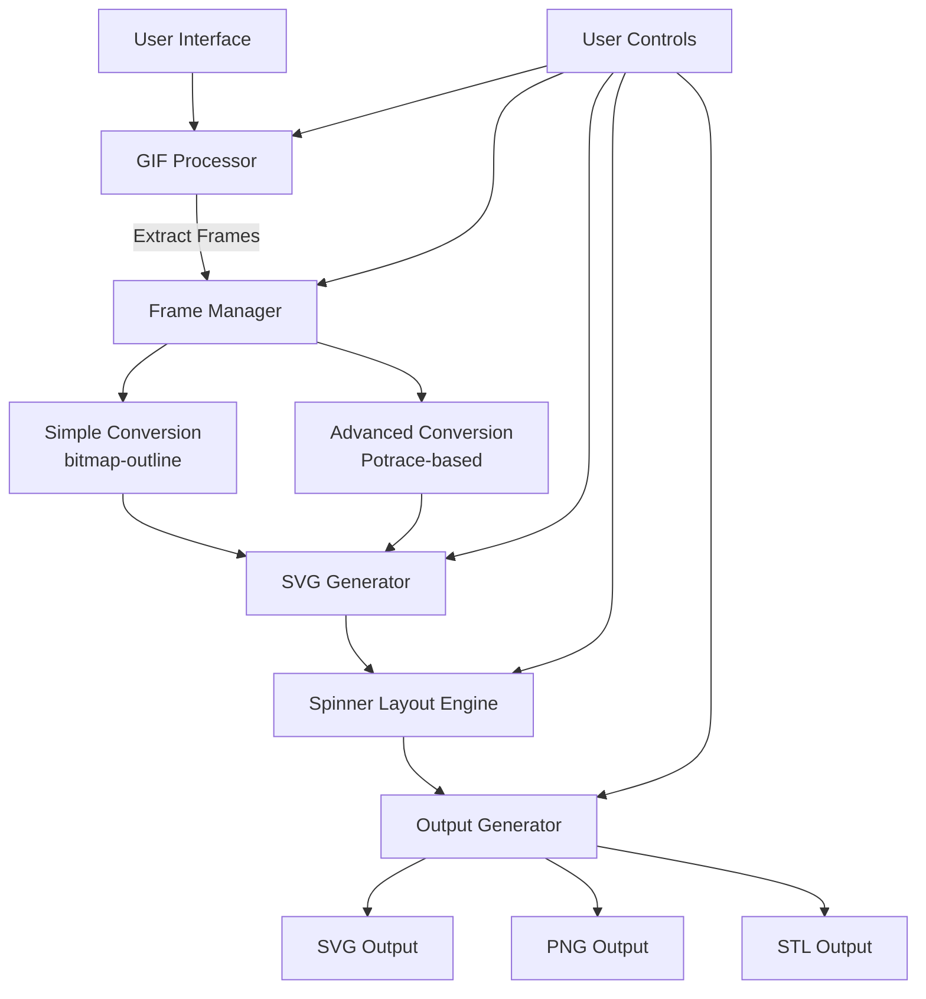

# GIF Spinner Generator - Project Plan

## 1. Technology Stack & Architecture

For this project, I recommend a client-side web application using plain HTML, CSS, and JavaScript:
- **Benefits**: Simple deployment to GitHub Pages, no build steps or server requirements, pure client-side processing
- **Structure**: Modular JavaScript with clearly separated responsibilities

## 2. Core Component: GIF-to-SVG Conversion

After researching available solutions, I've identified two distinct approaches for the critical GIF-to-SVG conversion:

### Option A: Simpler Approach - Direct Tracing with bitmap-outline

**Library**: [rshest/bitmap-outline](https://github.com/rshest/bitmap-outline)

**Strengths**:
- Lightweight (only 5 stars but very targeted functionality)
- Directly converts bitmap pixels to SVG paths
- Simple API with customizable options for corner rounding
- Pure client-side implementation
- Demo shows it works well for pixel art, which would match the aesthetics of many GIFs

**Weaknesses**:
- Less sophisticated than professional vectorization
- May struggle with complex gradients or detailed images
- Limited options for optimization

**Implementation Flow**:
1. Extract each frame from the GIF
2. For each frame:
   - Convert to bitmap data using Canvas
   - Apply optional preprocessing (thresholding, edge detection)
   - Use bitmap-outline to trace the pixels to SVG paths
   - Optimize the generated paths

### Option B: More Powerful Approach - Potrace-based Vectorization

**Libraries**: 
- [Potrace JavaScript Port](https://github.com/kilobyte/potrace) (or similar implementation)
- Combined with [gifuct-js](https://github.com/matt-way/gifuct-js) for GIF processing

**Strengths**:
- Industry-standard algorithm used in professional vectorization tools
- Better handling of curves and complex shapes
- More sophisticated path generation with fewer nodes
- Multiple options for optimization

**Weaknesses**:
- More dependencies and complexity
- Potentially slower processing
- May require more memory for complex operations

**Implementation Flow**:
1. Extract each frame from the GIF using gifuct-js
2. For each frame:
   - Convert to bitmap data using Canvas
   - Apply preprocessing (thresholding, color quantization)
   - Use Potrace algorithm to convert to SVG paths
   - Apply path optimization and simplification

### Hybrid Approach Recommendation

I recommend implementing a hybrid approach that gives users options:
- Start with the simpler bitmap-outline for faster processing and a "pixelated" aesthetic
- Offer an advanced option using Potrace-based vectorization for higher quality results
- Let users switch between methods based on their needs and the type of GIF

## 3. Detailed System Architecture



## 4. Feature Implementation Details

### 4.1. GIF Processing & Frame Extraction

```javascript
// Pseudocode for GIF processing
async function processGIF(gifFile) {
  // Use gifuct-js or gif.js to decode and extract frames
  const gif = await parseGIF(gifFile);
  const frames = extractFrames(gif);
  
  // Process each frame to normalized bitmap data
  const bitmapFrames = frames.map(frame => {
    const canvas = document.createElement('canvas');
    const ctx = canvas.getContext('2d');
    // Draw frame to canvas
    // Get imageData
    return {
      imageData: ctx.getImageData(0, 0, canvas.width, canvas.height),
      delay: frame.delay
    };
  });
  
  return bitmapFrames;
}
```

### 4.2. SVG Conversion Options

#### Simple Approach (bitmap-outline)
```javascript
function convertFrameToSVG_Simple(imageData, options) {
  // Process the imageData to get a bitmap (black/white pixels)
  const bitmap = preprocessBitmap(imageData, options);
  
  // Use bitmap-outline to get SVG paths
  const contours = bitmapOutline.findContours(bitmap);
  const svgPaths = bitmapOutline.contourToSVG(contours, {
    roundCorners: options.roundCorners
  });
  
  return createSVGDocument(svgPaths, imageData.width, imageData.height);
}
```

#### Advanced Approach (Potrace-based)
```javascript
function convertFrameToSVG_Advanced(imageData, options) {
  // Process the imageData for potrace
  const bitmap = preprocessForPotrace(imageData, options);
  
  // Use Potrace to get SVG paths
  const potraceResult = Potrace.trace(bitmap, {
    turdSize: options.turdSize,
    turnPolicy: options.turnPolicy,
    alphaMax: options.alphaMax,
    optCurve: options.optCurve,
    optTolerance: options.optTolerance
  });
  
  return potraceResult.toSVG(1.0);
}
```

### 4.3. Spinner Layout Engine

The spinner layout engine will arrange the SVG frames in a circular pattern:

```javascript
function createSpinnerLayout(svgFrames, options) {
  const { diameter, frameCount, spacing, bearingDiameter } = options;
  
  // Calculate positions for each frame
  const radius = (diameter - bearingDiameter) / 2 - spacing;
  const framePositions = [];
  
  for (let i = 0; i < frameCount; i++) {
    const angle = (i / frameCount) * 2 * Math.PI;
    framePositions.push({
      x: Math.cos(angle) * radius,
      y: Math.sin(angle) * radius,
      rotation: angle * (180 / Math.PI)
    });
  }
  
  // Create the spinner SVG
  const spinner = document.createElementNS("http://www.w3.org/2000/svg", "svg");
  spinner.setAttribute("width", diameter);
  spinner.setAttribute("height", diameter);
  
  // Add frames to spinner
  framePositions.forEach((position, i) => {
    // Clone and position each frame SVG
    const frame = svgFrames[i % svgFrames.length].cloneNode(true);
    // Apply transformations
    frame.setAttribute("transform", 
      `translate(${position.x + diameter/2}, ${position.y + diameter/2}) 
       rotate(${position.rotation})`);
    spinner.appendChild(frame);
  });
  
  // Add bearing
  const bearing = createBearing(bearingDiameter, options.bearingType);
  spinner.appendChild(bearing);
  
  // Add outline
  const outline = createSpinnerOutline(diameter, options.outlineStyle);
  spinner.appendChild(outline);
  
  return spinner;
}
```

### 4.4. 3D Generation for STL Output

For STL output, we'll convert the 2D SVG design to a 3D model:

```javascript
function convertToSTL(spinnerSVG, options) {
  // Set up three.js
  const scene = new THREE.Scene();
  
  // Create base spinner shape by extruding the SVG paths
  const spinnerGeometry = createExtrudedGeometry(spinnerSVG, {
    depth: options.thickness,
    bevelEnabled: false
  });
  
  // Add bearing hole/mount
  const bearingGeometry = createBearingGeometry(options.bearingType, 
    options.bearingDiameter, options.thickness);
  
  // Combine geometries using CSG operations
  const finalGeometry = CSG.subtract(spinnerGeometry, bearingGeometry);
  
  // Export to STL
  return exportSTL(finalGeometry);
}
```

## 5. User Interface & Controls

The UI will be clean and intuitive with these key sections:

1. **GIF Selection Area**
   - Upload button for custom GIFs
   - Gallery of pre-loaded GIFs
   - Preview of selected GIF

2. **Conversion Controls**
   - Conversion method selection (Simple/Advanced)
   - Processing options (thresholds, detail level)
   - Toggle for advanced options

3. **Spinner Designer**
   - Size controls (overall diameter, bearing size)
   - Frame count selection
   - Layout adjustments (spacing, position)
   - Outline style options

4. **Output Controls**
   - Format selection (SVG, PNG, STL)
   - Download buttons
   - Preview window

## 6. Implementation Plan & Timeline

### Phase 1: Core Infrastructure (3-4 days)
- Set up GitHub repository and Pages configuration
- Create basic UI layout
- Implement GIF upload and processing
- Basic frame extraction

### Phase 2: SVG Conversion (4-5 days)
- Implement bitmap-outline integration
- Create simple SVG conversion
- Implement frame processing workflow
- Add basic customization options

### Phase 3: Spinner Layout (3-4 days)
- Create circular arrangement algorithm
- Implement bearing placeholder
- Design spinner outline generation
- Connect user controls to layout options

### Phase 4: Advanced Features (4-5 days)
- Integrate Potrace-based conversion (advanced option)
- Implement STL generation
- Create output options and preview
- Add performance optimizations

### Phase 5: Refinement (2-3 days)
- UI polish and responsive design
- Comprehensive error handling
- Browser compatibility testing
- Documentation and help

## 7. Technical Considerations

### Performance
- Implement Web Workers for background processing
- Consider chunking large GIFs into batches
- Add progress indicators for long operations

### Browser Compatibility
- Ensure compatibility with modern browsers
- Implement fallbacks where needed
- Handle memory constraints on mobile devices

### GitHub Pages Integration
- Static hosting requires all processing to be client-side
- No server-side dependencies
- Consider asset management for pre-loaded GIFs

### Error Handling
- Validate input GIFs (size, frame count, format)
- Handle conversion failures gracefully
- Provide meaningful error messages

## 8. Future Enhancements

- User account system to save designs (would require external service)
- Advanced bearing designs (parametric generation)
- Animation preview using web camera simulation
- Social sharing integration
- Expanded gallery of pre-designed spinners